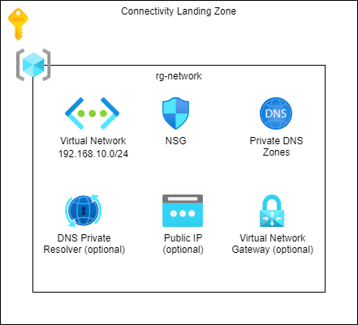

# Terraform - Azure - Connectivity landing zone

## Table of Contents

* [Introduction](#introduction)
* [Pre-Requirements](#pre-requirements)
* [Modules](#modules)
  * [Shared](#shared)
  * [DNS Private Resolver](#dns-private-resolver)
  * [Virtual Network Gateway](#virtual-network-gateway)

## Introduction

This is a collection of Terraform scripts that can be used to create Azure resources for the connectivity landing zone (Hub).

## Azure Infrastructure



## Pre-Requirements

* Service Principal
* Remote Backend
* [terraform-azure-setup-remote-backed](https://github.com/gutt02/terraform-azure-setup-remote-backend)

## Modules

### Shared

#### Azure Resources

* Resource Group
* Virtual Network and Subnets
* Network Security Groups
* Private DNS Zones

#### Variables

```hcl
# curl ipinfo.io/ip
variable "agent_ip" {
  type        = string
  description = "IP of the deployment agent."
}
```

```hcl

variable "client_ip" {
  type = object({
    name             = string
    cidr             = string
    start_ip_address = string
    end_ip_address   = string
  })

  description = "Client IP."
}
```

```hcl
variable "client_secret" {
  type        = string
  sensitive   = true
  description = "Client secret of the service principal."
}
```

```hcl
variable "location" {
  type        = string
  default     = "westeurope"
  description = "Default Azure region, use Azure CLI notation."
}
```

```hcl
variable "on_premises_networks" {
  type = list(object({
    name             = string
    cidr             = string
    start_ip_address = string
    end_ip_address   = string
  }))

  default = [
    {
      name             = "AllowFromOnPremises1"
      cidr             = "10.0.0.0/24"
      start_ip_address = "10.0.0.0"
      end_ip_address   = "10.0.0.255"
    }
  ]

  description = "List of on premises networks."
}
```

```hcl
variable "private_dns_zones" {
  type = map(string)

  default = {
    dns_zone_adf                       = "privatelink.adf.azure.com"
    dns_zone_agentsvc_azure_automation = "privatelink.agentsvc.azure-automation.net"
    dns_zone_azure_automation          = "privatelink.azure-automation.net"
    dns_zone_azuredatabricks           = "privatelink.azuredatabricks.net"
    dns_zone_azure_devices             = "privatelink.azure-devices.net"
    dns_zone_azuresynapse              = "privatelink.azuresynapse.net"
    dns_zone_blob                      = "privatelink.blob.core.windows.net"
    dns_zone_database                  = "privatelink.database.windows.net"
    dns_zone_datafactory               = "privatelink.datafactory.azure.net"
    dns_zone_dev_azuresynapse          = "privatelink.dev.azuresynapse.net"
    dns_zone_dfs                       = "privatelink.dfs.core.windows.net"
    dns_zone_file                      = "privatelink.file.core.windows.net"
    dns_zone_monitor                   = "privatelink.monitor.azure.com"
    dns_zone_oms_opinsights            = "privatelink.oms.opinsights.azure.com"
    dns_zone_ods_opinsights            = "privatelink.ods.opinsights.azure.com"
    dns_zone_queue                     = "privatelink.queue.core.windows.net"
    dns_zone_servicebus                = "privatelink.servicebus.windows.net"
    dns_zone_sql                       = "privatelink.sql.azuresynapse.net"
    dns_zone_table                     = "privatelink.table.core.windows.net"
    dns_zone_vaultcore                 = "privatelink.vaultcore.azure.net"
  }

  description = "Map of private DNS zones."
}
```

```hcl
variable "project" {
  type = object({
    customer    = string
    name        = string
    environment = string
  })

  default = {
    customer    = "azc"
    name        = "clz"
    environment = "vse"
  }

  description = "Project details, like customer name, environment, etc."
}
```

```hcl
variable "tags" {
  type = object({
    created_by  = string
    contact     = string
    customer    = string
    environment = string
    project     = string
  })

  default = {
    created_by  = "azc-iac-payg-sp-tf"
    contact     = "contact@me"
    customer    = "Azure Cloud"
    environment = "Visual Studio Enterprise"
    project     = "clz"
  }

  description = "Default tags for resources, only applied to resource groups"
}
```

```hcl
variable "virtual_network" {
  type = object({
    address_space = string

    subnets = map(object({
      name                = string
      address_space       = string
      client_address_pool = optional(string)
    }))
  })

  default = {
    address_space = "192.168.10.0/24"

    subnets = {
      gateway = {
        name                = "GatewaySubnet"
        address_space       = "192.168.10.0/27"
        client_address_pool = "192.168.255.0/27"
      },
      bastion = {
        name          = "AzureBastionSubnet"
        address_space = "192.168.10.32/27"
      },
      dnspr_inbound = {
        name          = "DNSPrivateResolverInbound"
        address_space = "192.168.10.64/28"
      },
      dnspr_outbound = {
        name          = "DNSPrivateResolverOutbound"
        address_space = "192.168.10.80/28"
      }
    }
  }

  description = "VNET destails."
}
```

### DNS Private Resolver

#### Azure Resources

* DNS Private Resolver

#### Variables

```hcl
variable "location" {
  type        = string
  default     = "westeurope"
  description = "Default Azure region, use Azure CLI notation."
}
```

```hcl
variable "project" {
  type = object({
    customer    = string
    name        = string
    environment = string
  })

  default = {
    customer    = "azc"
    name        = "clz"
    environment = "vse"
  }

  description = "Project details, like customer name, environment, etc."
}
```

```hcl
variable "resource_group_name" {
  type        = string
  description = "Resource group for the DNS Private Resolver deployment."
}
```

```hcl
variable "subnet_dnspr_inbound_id" {
  type        = string
  description = "Id of the inbound subnet."
}
```

```hcl
variable "virtual_network_id" {
  type        = string
  description = "Id of the Virtual Network for the DNS Private Resolver."
}
```

### Virtual Network Gateway

#### Azure Resources

* Virtual Network Gateway

#### Variables

```hcl
variable "location" {
  type        = string
  default     = "westeurope"
  description = "Default Azure region, use Azure CLI notation."
}
```

```hcl
variable "project" {
  type = object({
    customer    = string
    name        = string
    environment = string
  })

  default = {
    customer    = "azc"
    name        = "clz"
    environment = "vse"
  }

  description = "Project details, like customer name, environment, etc."
}
```

```hcl
variable "resource_group_name" {
  type        = string
  description = "Resource group for the DNS Private Resolver deployment."
}
```

```hcl
variable "subnet_gateway_id" {
  type        = string
  description = "Id of the Gateway subnet."
}
```

```hcl
variable "virtual_network_gateway" {
  type = object({
    type          = string
    vpn_type      = string
    active_active = optional(bool)
    enable_bgp    = optional(bool)
    sku           = string

    vpn_client_configuration = object({
      address_space        = list(string)
      vpn_client_protocols = list(string)

      root_certificate = object({
        name = string
      })
    })
  })

  default = {
    type     = "Vpn"
    vpn_type = "RouteBased"
    sku      = "VpnGw1"

    vpn_client_configuration = {
      address_space        = ["192.168.255.0/27"]
      vpn_client_protocols = ["IkeV2", "OpenVPN"]

      root_certificate = {
        name = "VnetGatewayConfig"
      }
    }
  }

  description = "Virtual network gateway details."
}
```

#### Resources

[Generate and export certificates for point-to-site using PowerShell](https://learn.microsoft.com/en-us/azure/vpn-gateway/vpn-gateway-certificates-point-to-site)
